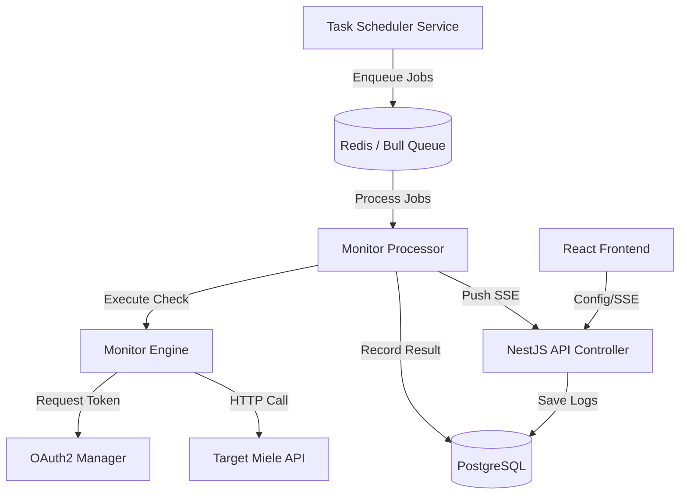
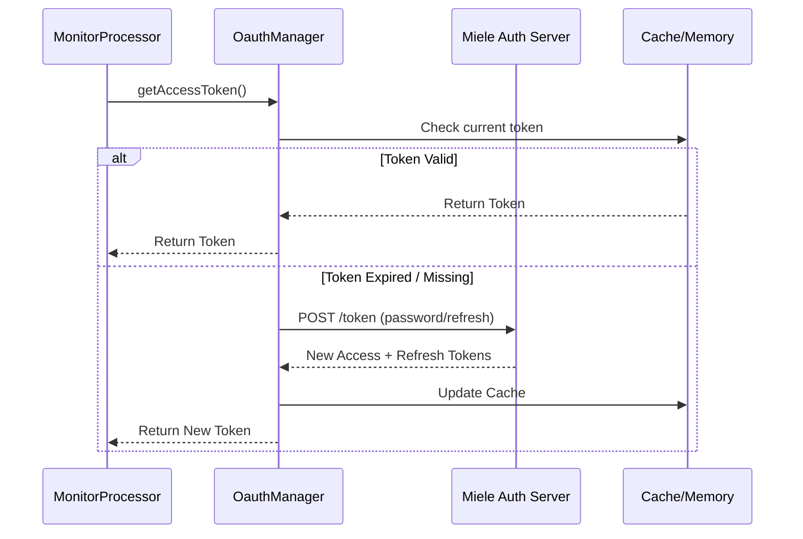
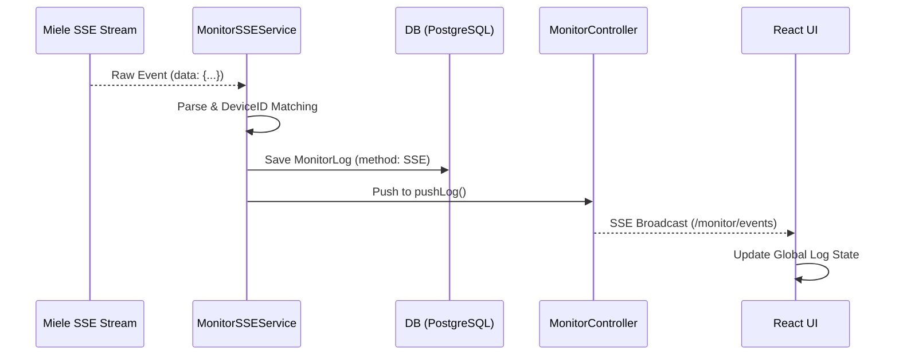

# Architecture Overview: API Sentinel

This document details the internal workings of API Sentinel, describing the flow of data from the task scheduler to the monitoring dashboard.

## 🏗️ The High-Level Flow

API Sentinel is built as a distributed worker system. It leverages a producer-consumer pattern to ensure monitoring tasks are executed reliably without blocking the main API thread.

## 🧩 Backend Architecture (NestJS)

The backend is modularized into specialized services within the `monitor` module:

### 1. The Orchestrators
- **TaskSchedulerService**: Reads the `openapi.yaml` and the current user configuration (`MonitorConfigService`). It calculates intervals and enqueues monitoring jobs into the Bull queue.
- **MonitorProcessor**: The background worker. It consumes jobs, coordinates with the engine, and handles persistence.

### 2. The Functional Services
- **OauthManagerService**: Manages the lifecycle of OAuth2 tokens.
  - Implements a 6-hour health check to verify credential validity.
  - Supports "Password Grant" flow.
  - Maintains an internal cache with automatic refresh logic.
- **MonitorEngineService**: Encapsulates the actual HTTP execution logic. It standardizes the `User-Agent` and maps external API responses into the internal `MonitorLog` schema.
- **MonitorSSEService**: Manages persistent, long-lived background connections to Miele's event streams. It broadcasts raw events to an internal `Subject` and handles the standalone terminal bridge.
- **OpenapiParserService**: A utility service that translates complex YAML definitions into structured endpoint lists used by both the scheduler and the frontend.

### 3. Real-time & Data
- **MonitorController**: The communication hub.
  - Provides SSE (Server-Sent Events) on `/monitor/events` to the frontend.
  - Aggregates logs into metrics (latency, success rates) for the dashboard.

---

## 🔄 Interaction Flows

### OAuth2 Token Management

### SSE Event Pipeline

---

## 🔐 Security Deep Dive

### Credential Handling
- **Environment Isolation**: Sensitive credentials (`CLIENT_ID`, `CLIENT_SECRET`, `PASSWORD`) are read exclusively from `.env`.
- **Token Scrubbing**: OAuth tokens are stored in memory and never persisted to the log database. The `MonitorLog` only records "Success/Failure" and status codes.
- **User-Agent Masquerading**: All outgoing requests use a specialized `User-Agent` (`API-Sentinel/v0.0.1`) to ensure traceability while preventing generic blocking.

### Persistence Security
- **Config Store**: The `config.json` file (used for UI-driven settings) is protected with filesystem permissions (`600`) in production environments.
- **Database Access**: The PostgreSQL instance is isolated within the internal Docker network and is not exposed to the host by default.

---

## 📊 Data Schema

### `MonitorLog`
Stores every individual request result:
- `path`, `method`
- `statusCode`, `latency`, `success`
- `responseData`: Captured JSON payload for inspection.
- `requestData`: Captured payload for `PUT` requests.
- `deviceId`: Mapped hardware identifier.

### `AuthLog`
Tracks the health of the OAuth2 authentication flow, logging every login attempt and failure reason.
