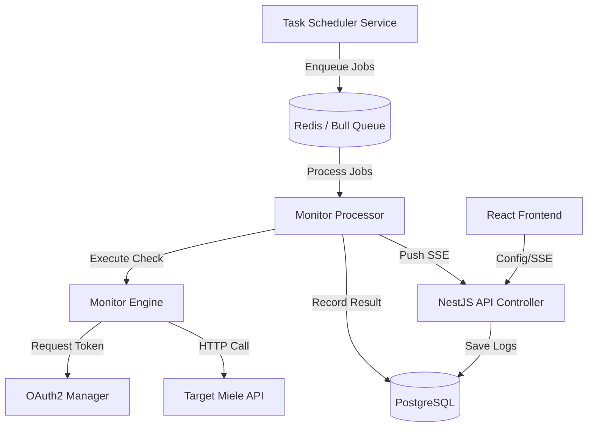

# Architecture Overview: API Sentinel

This document details the internal workings of API Sentinel, describing the flow of data from the task scheduler to the monitoring dashboard.

## 🏗️ The High-Level Flow

API Sentinel is built as a distributed worker system. It leverages a producer-consumer pattern to ensure monitoring tasks are executed reliably without blocking the main API thread.

## 🧩 Backend Architecture (NestJS)

The backend is modularized into specialized services within the `monitor` module:

### 1. The Orchestrators
- **TaskSchedulerService**: Reads the `openapi.yaml` and the current user configuration (`MonitorConfigService`). It calculates intervals and enqueues monitoring jobs into the Bull queue.
- **MonitorProcessor**: The background worker. It consumes jobs, coordinates with the engine, and handles persistence.

### 2. The Functional Services
- **OauthManagerService**: Manages the lifecycle of OAuth2 tokens.
  - Implements a 6-hour health check to verify credential validity.
  - Supports "Password Grant" flow.
  - Maintains an internal cache with automatic refresh logic.
- **MonitorEngineService**: Encapsulates the actual HTTP execution logic. It standardizes the `User-Agent` and maps external API responses into the internal `MonitorLog` schema.
- **OpenapiParserService**: A utility service that translates complex YAML definitions into structured endpoint lists used by both the scheduler and the frontend.

### 3. Real-time & Data
- **MonitorController**: The communication hub.
  - Provides SSE (Server-Sent Events) on `/monitor/events`.
  - Aggregates logs into metrics (latency, success rates) for the dashboard.

## 📊 Data Schema

### `MonitorLog`
Stores every individual request result:
- `path`, `method`
- `statusCode`
- `latency` (ms)
- `success` (boolean)
- `error` (text)
- `timestamp`

### `AuthLog`
Tracks the health of the OAuth2 authentication flow:
- `success`
- `statusCode`
- `latency`
- `errorMessage`
- `tokenType` (access/manual)

---

## 🔐 OAuth2 Monitoring Logic

API Sentinel treats authentication as a first-class citizen. 

1. **Self-Healing Auth**: If a monitoring task detects a `401 Unauthorized`, the engine triggers the `OauthManagerService` to fetch a fresh token.
2. **Proactive Verification**: Even if no monitoring tasks are running, the system performs a "Health Check" login every 6 hours. This ensures that credential expiration or upstream auth server issues are detected and logged before they affect actual monitoring data.
